# 🏗️ AWS Three-Tier Architecture with CloudFormation

<div align="center">


[](https://aws.amazon.com/cloudformation/)
[](LICENSE)
[](https://aws.amazon.com/)

### 🎯 Enterprise-Grade Three-Tier Architecture on AWS

**Infrastructure as Code for scalable, secure, and highly available cloud applications**

[Architecture](#-architecture-deep-dive) • [Quick Deploy](#-quick-deployment) • [Features](#-key-features) • [Extend](#-future-enhancements)

</div>

---
## 📸 Architecture

Below is the network architecture of the VPC setup:


---

This project uses **Terraform** to create a **VPC infrastructure** on AWS, including public and private subnets, Internet Gateway, NAT Gateway, route tables, security groups, and EC2 instances.


## 🌟 What Makes This Special?

This isn't just another CloudFormation template—it's a **production-ready foundation** for enterprise applications that prioritizes:

<table>
<tr>
<td align="center" width="25%">
<br/>
<b>High Availability</b><br/>
Multi-AZ deployment<br/>
Zero single point of failure
</td>
<td align="center" width="25%">
<br/>
<b>Security First</b><br/>
Defense in depth<br/>
Principle of least privilege
</td>
<td align="center" width="25%">
<br/>
<b>Auto Scaling</b><br/>
Elastic capacity<br/>
Cost optimization
</td>
<td align="center" width="25%">
<br/>
<b>100% IaC</b><br/>
Repeatable deployments<br/>
Version controlled
</td>
</tr>
</table>

---

## 🎯 Project Mission

Modern cloud applications demand more than just servers—they need **resilient architectures** that can:


This project delivers **all of that** through Infrastructure as Code.

---

## 🏛️ Architecture Deep Dive

### 🎨 Visual Architecture

```mermaid
graph TB
    subgraph Internet
        Users[👥 End Users]
        IGW[🌐 Internet Gateway]
    end
    
    subgraph VPC[VPC - 10.0.0.0/16]
        subgraph AZ1[Availability Zone A]
            subgraph Public1[Public Subnet<br/>10.0.1.0/24]
                WEB1[🌐 Web Server 1<br/>EC2 Instance]
                NAT1[🔀 NAT Gateway]
            end
            
            subgraph Private1[Private Subnet<br/>10.0.11.0/24]
                APP1[⚙️ App Server 1<br/>EC2 Instance]
            end
            
            subgraph Data1[DB Subnet<br/>10.0.21.0/24]
                DB1[(🗄️ RDS Primary<br/>MySQL)]
            end
        end
        
        subgraph AZ2[Availability Zone B]
            subgraph Public2[Public Subnet<br/>10.0.2.0/24]
                WEB2[🌐 Web Server 2<br/>EC2 Instance]
                NAT2[🔀 NAT Gateway]
            end
            
            subgraph Private2[Private Subnet<br/>10.0.12.0/24]
                APP2[⚙️ App Server 2<br/>EC2 Instance]
            end
            
            subgraph Data2[DB Subnet<br/>10.0.22.0/24]
                DB2[(🗄️ RDS Standby<br/>MySQL)]
            end
        end
        
        ALB[⚖️ Application Load Balancer]
    end
    
    Users -->|HTTPS| IGW
    IGW --> ALB
    ALB -->|Route| WEB1
    ALB -->|Route| WEB2
    
    WEB1 -->|API Calls| APP1
    WEB2 -->|API Calls| APP2
    
    APP1 & APP2 -->|SQL Queries| DB1
    DB1 -.->|Replication| DB2
    
    APP1 & APP2 -->|Internet Access| NAT1
    APP1 & APP2 -->|Internet Access| NAT2
    
  
```



---

### 🔄 Traffic Flow Patterns

**User Request Journey:**


---

### 📊 Tier Breakdown

<table>
<tr>
<th width="25%">Tier</th>
<th width="25%">Components</th>
<th width="25%">Subnet Type</th>
<th width="25%">Security</th>
</tr>

<tr>
<td>

**🌐 Web Tier**<br/>
*Presentation Layer*

</td>
<td>

• EC2 Instances<br/>
• Auto Scaling Group<br/>
• Application Load Balancer<br/>
• Static content (S3/CloudFront)

</td>
<td>

**Public Subnets**<br/>
`10.0.1.0/24` (AZ-A)<br/>
`10.0.2.0/24` (AZ-B)

</td>
<td>

• Internet-facing<br/>
• HTTP/HTTPS only<br/>
• Web Security Group<br/>
• SSL/TLS termination

</td>
</tr>

<tr>
<td>

**⚙️ App Tier**<br/>
*Business Logic Layer*

</td>
<td>

• EC2 Instances<br/>
• Auto Scaling Group<br/>
• Application servers<br/>
• API endpoints

</td>
<td>

**Private Subnets**<br/>
`10.0.11.0/24` (AZ-A)<br/>
`10.0.12.0/24` (AZ-B)

</td>
<td>

• No direct internet<br/>
• Accept from Web tier only<br/>
• NAT for outbound<br/>
• App Security Group

</td>
</tr>

<tr>
<td>

**🗄️ Database Tier**<br/>
*Data Layer*

</td>
<td>

• RDS Multi-AZ<br/>
• Read Replicas<br/>
• Automated backups<br/>
• Encryption at rest

</td>
<td>

**Isolated Subnets**<br/>
`10.0.21.0/24` (AZ-A)<br/>
`10.0.22.0/24` (AZ-B)

</td>
<td>

• Completely isolated<br/>
• Accept from App tier only<br/>
• No internet access<br/>
• DB Security Group

</td>
</tr>
</table>

---

## 🔐 Security Architecture

### Defense in Depth Strategy

```mermaid
graph TB
    A[🌐 Internet] --> B[WAF - Web Application Firewall]
    B --> C[CloudFront - DDoS Protection]
    C --> D[ALB - SSL/TLS Termination]
    D --> E[Security Group - Web Tier]
    E --> F[Security Group - App Tier]
    F --> G[Security Group - Database Tier]
    G --> H[Encryption at Rest]
    
   
```



### 🛡️ Security Group Rules

**Web Tier Security Group:**
```yaml
Inbound:
  - Port 80 (HTTP) from 0.0.0.0/0
  - Port 443 (HTTPS) from 0.0.0.0/0

Outbound:
  - Port 8080 to App Tier Security Group
  - Port 443 to Internet (for updates)
```

**Application Tier Security Group:**
```yaml
Inbound:
  - Port 8080 from Web Tier Security Group only

Outbound:
  - Port 3306 to Database Tier Security Group
  - Port 443 to Internet via NAT (for external APIs)
```

**Database Tier Security Group:**
```yaml
Inbound:
  - Port 3306 from App Tier Security Group only

Outbound:
  - None (completely isolated)
```

---

## 🌐 Network Architecture

### IP Address Design

| Component | CIDR Block | Available IPs | Purpose |
|-----------|-----------|---------------|---------|
| **VPC** | `10.0.0.0/16` | 65,536 | Main VPC network |
| **Public Subnet AZ-A** | `10.0.1.0/24` | 251 | Web tier (AZ-A) |
| **Public Subnet AZ-B** | `10.0.2.0/24` | 251 | Web tier (AZ-B) |
| **Private Subnet AZ-A** | `10.0.11.0/24` | 251 | App tier (AZ-A) |
| **Private Subnet AZ-B** | `10.0.12.0/24` | 251 | App tier (AZ-B) |
| **DB Subnet AZ-A** | `10.0.21.0/24` | 251 | Database (AZ-A) |
| **DB Subnet AZ-B** | `10.0.22.0/24` | 251 | Database (AZ-B) |

### Routing Tables

**Public Route Table:**
```
Destination         Target
10.0.0.0/16        local
0.0.0.0/0          igw-xxxxx (Internet Gateway)
```

**Private Route Table:**
```
Destination         Target
10.0.0.0/16        local
0.0.0.0/0          nat-xxxxx (NAT Gateway)
```

**Database Route Table:**
```
Destination         Target
10.0.0.0/16        local
(No internet route - completely isolated)
```

---

## 🚀 Quick Deployment

### Prerequisites Checklist

```bash
✅ Active AWS account
✅ IAM user with CloudFormation, VPC, EC2 permissions
✅ AWS CLI installed (optional)
✅ Basic understanding of AWS networking
```

### 🎯 One-Click Deployment

**Method 1: AWS Console (Recommended for beginners)**

1. **Clone Repository**
   ```bash
   git clone https://github.com/sujalkamanna/three-tier-architecture.git
   cd three-tier-architecture
   ```

2. **Open AWS Console**
   - Navigate to **CloudFormation** service
   - Click **Create stack** → **With new resources**

3. **Upload Template**
   - Choose **Upload a template file**
   - Select: `cloudformation/vpc-network.yaml`
   - Click **Next**

4. **Configure Stack**
   - **Stack name**: `three-tier-vpc-prod`
   - **Environment**: `Production`
   - Click **Next** → **Next**

5. **Deploy**
   - Check ✅ "I acknowledge that AWS CloudFormation might create IAM resources"
   - Click **Create stack**

6. **Wait for Completion**
   - Status will change: `CREATE_IN_PROGRESS` → `CREATE_COMPLETE`
   - Time: ~5-10 minutes

---

**Method 2: AWS CLI (For automation)**

```bash
# Validate template
aws cloudformation validate-template \
    --template-body file://cloudformation/vpc-network.yaml

# Create stack
aws cloudformation create-stack \
    --stack-name three-tier-vpc-prod \
    --template-body file://cloudformation/vpc-network.yaml \
    --parameters ParameterKey=Environment,ParameterValue=Production \
    --capabilities CAPABILITY_IAM

# Monitor deployment
aws cloudformation wait stack-create-complete \
    --stack-name three-tier-vpc-prod

# Get outputs
aws cloudformation describe-stacks \
    --stack-name three-tier-vpc-prod \
    --query 'Stacks[0].Outputs'
```

---

## 📋 Post-Deployment Validation

### Automated Validation Script

```bash
#!/bin/bash
# validate-deployment.sh

STACK_NAME="three-tier-vpc-prod"

echo "🔍 Validating Three-Tier Architecture Deployment..."

# 1. Check VPC
echo "✓ Checking VPC..."
aws ec2 describe-vpcs --filters "Name=tag:aws:cloudformation:stack-name,Values=$STACK_NAME"

# 2. Check Subnets
echo "✓ Checking Subnets (should be 6)..."
aws ec2 describe-subnets --filters "Name=tag:aws:cloudformation:stack-name,Values=$STACK_NAME" | grep SubnetId | wc -l

# 3. Check Internet Gateway
echo "✓ Checking Internet Gateway..."
aws ec2 describe-internet-gateways --filters "Name=tag:aws:cloudformation:stack-name,Values=$STACK_NAME"

# 4. Check NAT Gateways
echo "✓ Checking NAT Gateways (should be 2)..."
aws ec2 describe-nat-gateways --filter "Name=tag:aws:cloudformation:stack-name,Values=$STACK_NAME" | grep NatGatewayId | wc -l

# 5. Check Route Tables
echo "✓ Checking Route Tables..."
aws ec2 describe-route-tables --filters "Name=tag:aws:cloudformation:stack-name,Values=$STACK_NAME"

# 6. Check Security Groups
echo "✓ Checking Security Groups (should be 3)..."
aws ec2 describe-security-groups --filters "Name=tag:aws:cloudformation:stack-name,Values=$STACK_NAME" | grep GroupId | wc -l

echo "✅ Validation Complete!"
```

### Manual Checklist

| Component | Expected | Verify |
|-----------|----------|--------|
| **VPC** | 1 VPC with `10.0.0.0/16` | ☐ |
| **Subnets** | 6 subnets (2 public, 2 private, 2 DB) | ☐ |
| **Internet Gateway** | 1 attached to VPC | ☐ |
| **NAT Gateways** | 2 (one per AZ) | ☐ |
| **Elastic IPs** | 2 (for NAT Gateways) | ☐ |
| **Route Tables** | 3 (public, private, DB) | ☐ |
| **Security Groups** | 3 (web, app, database) | ☐ |
| **Tags** | All resources properly tagged | ☐ |

---

## 🎓 CloudFormation Template Explained

### Template Structure

```yaml
AWSTemplateFormatVersion: '2010-09-09'
Description: 'Three-Tier Architecture with Multi-AZ'

Parameters:
  EnvironmentName:
    Type: String
    Default: Production
    Description: Environment name prefix

Resources:
  # 1. VPC
  VPC:
    Type: AWS::EC2::VPC
    Properties:
      CidrBlock: 10.0.0.0/16
      EnableDnsHostnames: true
      Tags:
        - Key: Name
          Value: !Sub ${EnvironmentName}-VPC

  # 2. Internet Gateway
  InternetGateway:
    Type: AWS::EC2::InternetGateway

  # 3. Subnets (6 total)
  PublicSubnet1:
    Type: AWS::EC2::Subnet
    Properties:
      VpcId: !Ref VPC
      CidrBlock: 10.0.1.0/24
      AvailabilityZone: !Select [0, !GetAZs '']

  # 4. NAT Gateways
  NatGateway1:
    Type: AWS::EC2::NatGateway
    Properties:
      AllocationId: !GetAtt NatGateway1EIP.AllocationId
      SubnetId: !Ref PublicSubnet1

  # 5. Route Tables
  PublicRouteTable:
    Type: AWS::EC2::RouteTable
    Properties:
      VpcId: !Ref VPC

  # 6. Security Groups
  WebSecurityGroup:
    Type: AWS::EC2::SecurityGroup
    Properties:
      GroupDescription: Security group for web tier

Outputs:
  VPCId:
    Description: VPC ID
    Value: !Ref VPC
    Export:
      Name: !Sub ${EnvironmentName}-VPC-ID
```

---

### 💡 Cost Optimization Tips

- Use **Reserved Instances** for predictable workloads (save up to 72%)
- Enable **Auto Scaling** to scale down during off-peak hours
- Use **Spot Instances** for non-critical app tier servers
- Consider **AWS Savings Plans** for long-term commitments
- Delete **NAT Gateways** in dev/test environments
- Use **S3 Gateway Endpoints** (free) instead of NAT for S3 access

---

## 🔧 Extend the Architecture

### Phase 1: Add Compute Resources

```bash
# Deploy web tier instances
aws cloudformation create-stack \
    --stack-name web-tier \
    --template-body file://cloudformation/web-tier.yaml \
    --parameters ParameterKey=VPCStackName,ParameterValue=three-tier-vpc-prod
```

### Phase 2: Add Database

```bash
# Deploy RDS Multi-AZ
aws cloudformation create-stack \
    --stack-name database-tier \
    --template-body file://cloudformation/database-tier.yaml \
    --parameters ParameterKey=VPCStackName,ParameterValue=three-tier-vpc-prod
```

### Phase 3: Add Monitoring

```bash
# Deploy CloudWatch dashboards & alarms
aws cloudformation create-stack \
    --stack-name monitoring-stack \
    --template-body file://cloudformation/monitoring.yaml
```

---

## 🛠️ Troubleshooting

<details>
<summary><b>Stack Creation Failed</b></summary>

**Common Causes:**
1. Insufficient IAM permissions
2. Service limit exceeded (EIPs, VPCs)
3. Invalid CIDR blocks

**Solution:**
```bash
# Check stack events
aws cloudformation describe-stack-events \
    --stack-name three-tier-vpc-prod \
    --max-items 10

# Delete failed stack
aws cloudformation delete-stack \
    --stack-name three-tier-vpc-prod
```

</details>

<details>
<summary><b>NAT Gateway Not Working</b></summary>

**Verification:**
```bash
# Check NAT Gateway status
aws ec2 describe-nat-gateways \
    --filter "Name=state,Values=available"

# Verify route table
aws ec2 describe-route-tables \
    --filters "Name=tag:Name,Values=*Private*"
```

</details>

<details>
<summary><b>Cannot Connect to Private Instances</b></summary>

**Use Bastion Host:**
```bash
# SSH through bastion in public subnet
ssh -i key.pem ec2-user@bastion-public-ip

# Then SSH to private instance
ssh ec2-user@private-instance-ip
```

</details>

---

## 📚 Learning Resources

| Topic | Resource | Level |
|-------|----------|-------|
| **AWS VPC** | [AWS VPC Documentation](https://docs.aws.amazon.com/vpc/) | Beginner |
| **CloudFormation** | [AWS CloudFormation Guide](https://docs.aws.amazon.com/cloudformation/) | Intermediate |
| **Multi-Tier Architecture** | [AWS Architecture Center](https://aws.amazon.com/architecture/) | Advanced |
| **Security Best Practices** | [AWS Well-Architected](https://aws.amazon.com/architecture/well-architected/) | All Levels |

---

## 🚀 Future Enhancements

### Roadmap

- [x] Core VPC networking
- [x] Multi-AZ subnets
- [x] Security groups
- [ ] **Application Load Balancer**
- [ ] **Auto Scaling Groups**
- [ ] **RDS Multi-AZ deployment**
- [ ] **ElastiCache for session management**
- [ ] **CloudWatch dashboards**
- [ ] **AWS WAF integration**
- [ ] **Route 53 DNS**
- [ ] **ACM SSL certificates**
- [ ] **Container support (ECS/EKS)**
- [ ] **CI/CD pipeline**
- [ ] **Disaster recovery automation**

---

## 📜 License

**MIT License** - Free to use, modify, and distribute.

```
Copyright (c) 2024 Sujal Kamanna

Permission is hereby granted, free of charge, to any person obtaining a copy...
```

📄 [Full License](LICENSE)

---

## 👨‍💻 Author

<div align="center">

**Sujal Kamanna**  
*Cloud & DevOps Engineer*

[](https://linkedin.com/in/yourprofile)
[](https://github.com/sujalkamanna)
[](mailto:your@email.com)

</div>

---

## 🙏 Acknowledgments

Special thanks to:
- **AWS** for comprehensive documentation
- **CloudFormation community** for best practices
- **AWS Solutions Architects** for architecture patterns

---

## 📊 Project Stats

<div align="center">


</div>

---

<div align="center">

### ⭐ If this helped you, please star the repository!

**Built with ❤️ for the AWS community**

---

**[⬆ Back to Top](#%EF%B8%8F-aws-three-tier-architecture-with-cloudformation)**

</div>
